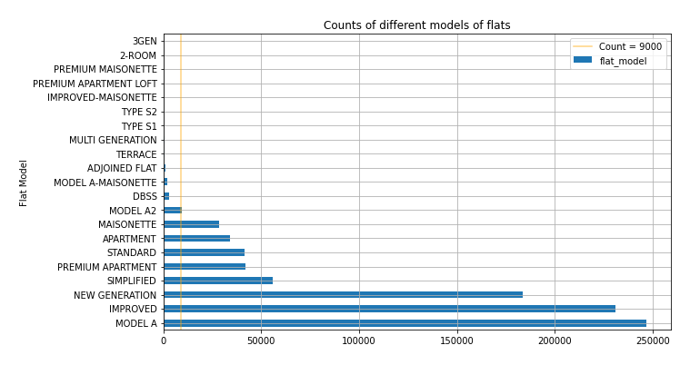
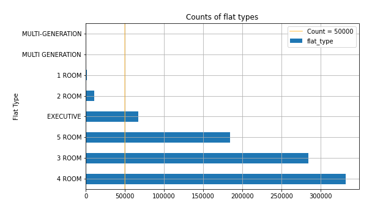
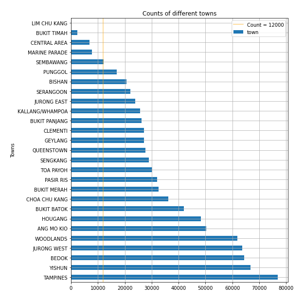

Exploratory data analysis (EDA) is a crucial part in any machine learning project, as it allows one to discover more insights about the data before fully committing to a certain approach in going through the project. 

# Plan
In achieving this goal, we:

1. Collated all our data into a single, unified dataset where all our analysis will be conducted in.
2. Plotted bar charts of the various categories for `flat_model`, `town`, and `flat_type` to detect categories that have very small counts. This is to group these into an `other` group that represents the minority categories for each feature.
3. Used `pandas_profiling` to allow for automated EDA report generation. The report is available [here](df_combined_report.html).

# Plots
In grouping the three features into an `other` category as above, we decided to put the boundaries as (in terms of counts):

* 9,000 for `flat_model` 
* 50,000 for `flat_type` 
* 12,000 for `town` (note that Sembawang is still included as a separate category) 
  
# Preliminary analysis

We discovered several features of the dataset, including:

* High correlation between the floor area, resale price, and lease commencement date.
* High correlation between flat model, flat type, floor area, and lease commencement date.
* High correlation between town, flat model, and lease commencement date.
* Missing remaining lease data for most of the columns, which is imputable using a 99-year HDB lease assumption.

These are given by the $\phi_k$ correlation coefficient which is able to work well with both categorical and numerical columns in the dataset.