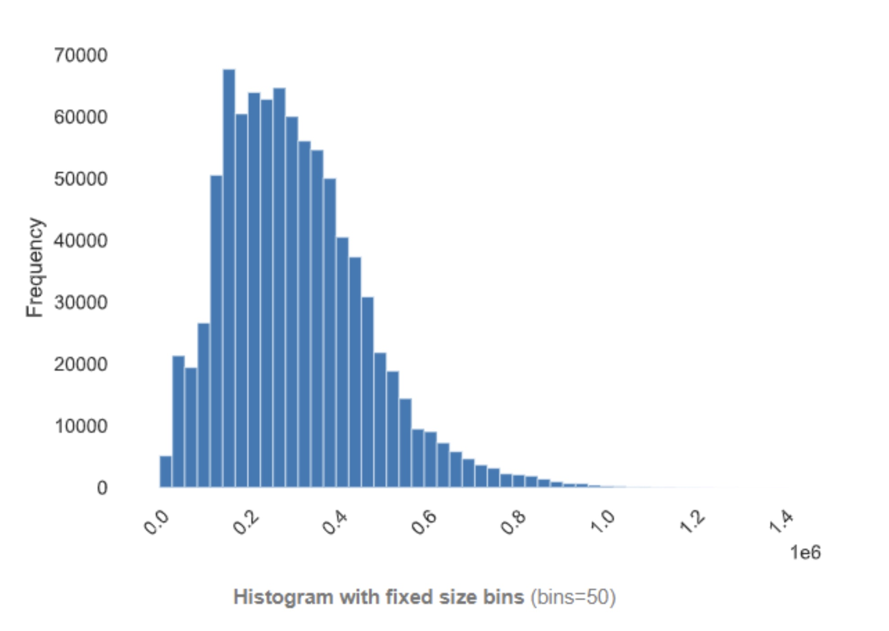

# General description
The following evaluation metrics are options that we have considered. However, to judge the efficacy of our models, we have decided on primarily using the mean absolute percentage error (MAPE) and median absolute percentage error (MdAPE). These evaluation metrics are best suited for our particular dataset due to property prices having a wider range of values, i.e. a percentage error indicates a similar proportion of impact be it for a $100,000 or a $10,000,000 property. This is crucial as the resale price has a heavy right-tailed distribution (see the figure below; also available in the EDA report) due to some properties having very high transaction prices. Furthermore, both the MAPE and the MdAPE are more easily understandable metrics as they are described in terms of percentages.

## Price histogram
Below is a histogram of resale property prices, which indicates a heavy right-tailed distribution.

# Primary model evaluations
In this section, we shall detail the performance metrics of the models that our team has created. Note that since this is only a primary stage of evaluation, we only compare the different models based on the five metrics that we have chosen, without any accompanying data visualisations.

## Biased model results
Please visit [this page](results-biased.md) to view the performance metrics of our models that have been trained using an arbitrary train-test split, i.e., the results of models tainted with lookahead bias. For more details this issue and our solution, please visit [this page](lookahead-bias.md).

A notable result is that of kNN regressor, where the MAPE was close to 0%, indicating that there must be some serious issue either with overfitting or with the training data.

## Unbiased model results
Please visit [this page](results-unbiased.md) to view the performance metrics of our models trained after fixing the lookahead bias.

As we can see, the best models are (in order of increasing MdAPE) rolling bagging regressor, rolling kNN regressor, and rolling XGBoost regressor. Hence we shall choose these three models for further analysis below.

# Extended model evaluations
In this section, we shall detail the three models that we have selected, namely rolling bagging regressor, rolling kNN regressor, and rolling XGBoost regressor in more depth through the use of data visualisations on the models' predictions.

All models perform poorly at the start of the period (which is in 1991) according to the MAPE and MdAPE metrics due to a lack of data from previous time intervals. In several towns, most notably Sembawang, the models perform exceptionally poorly across certain time periods due to sparsity of data in those time periods. For example, the number of data points each year for Sembawang is less than 10 from 1990 to 2001, with many years having only 2 data points. This lack of transaction data can be seen with [this visualisation](town-over-time-fig.html).

It can also be noted that across all chosen models, the mean absolute error is the highest for towns near the southern region of central Singapore, such as Bukit Merah (7.19/7.55/7.51), Queenstown (7.49/7.90/7.70) and Kallang (7.38/7.56/7.68) (from left to right: rolling bagging regressor, rolling XGBoost regressor, rolling kNN regressor). This is most likely due to the smaller number of datapoints for towns in said region across the entire timeframe, as indicated by the size of the bubbles in [this figure](town-overall-fig.html).

We list out the visualisations that support the above points below:

| |Rolling bagging regressor | Rolling kNN regressor | Rolling XGBoost regressor | 
|-|----|--------|----------|
| Per-HDB scatter mapbox of MAPEs |[baggingregressor-lat-lon-fig](./rolling-baggingregressor/baggingregressor-lat-lon-fig.html) | [knnregressor-lat-lon-fig](./rolling-knnregressor/knnregressor-lat-lon-fig.html) | [xgboost-lat-lon-fig](./rolling-xgboost/xgboost-lat-lon-fig.html)|
| Per-town scatter mapbox of MAPEs |[baggingregressor-town-fig](./rolling-baggingregressor/baggingregressor-town-fig.html) | [knnregressor-town-fig](./rolling-knnregressor/knnregressor-town-fig.html)| [xgboost-town-fig](./rolling-xgboost/xgboost-town-fig.html)|
| Per-town scatter mapbox of MdAPEs | [baggingregressor-town-fig-med](./rolling-baggingregressor/baggingregressor-town-fig-med.html) | [knnregressor-town-fig-med](./rolling-knnregressor/knnregressor-town-fig-med.html) | [xgboost-town-fig-med](./rolling-xgboost/xgboost-town-fig-med.html)|
| Per-town yearly scatter mapbox of MAPEs | [baggingregressor-time-town-fig](./rolling-baggingregressor/baggingregressor-time-town-fig.html) |[knnregressor-time-town-fig](./rolling-knnregressor/knnregressor-time-town-fig.html) | [xgboost-time-town-fig](./rolling-xgboost/xgboost-time-town-fig.html) |
| Per-town yearly line plot of MAPEs |[baggingregressor-mape-time-town](./rolling-baggingregressor/baggingregressor-mape-time-town.html) | [knnregressor-mape-time-town](./rolling-knnregressor/knnregressor-mape-time-town.html) | [xgboost-mape-time-town](./rolling-xgboost/xgboost-mape-time-town.html) |
| Per-town yearly line plot of MdAPEs |[baggingregressor-mdape-time-town](./rolling-baggingregressor/baggingregressor-mdape-time-town.html) |[knnregressor-mdape-time-town](./rolling-knnregressor/knnregressor-mdape-time-town.html) | [xgboost-mdape-time-town](./rolling-xgboost/xgboost-mdape-time-town.html) |
| Per-town yearly boxplot of MAPEs |[baggingregressor-mape-boxplot-town](./rolling-baggingregressor/baggingregressor-mape-boxplot-town.html) | [knnregressor-mape-boxplot-town](./rolling-knnregressor/knnregressor-mape-boxplot-town.html)| [xgboost-mape-boxplot-town](./rolling-xgboost/xgboost-mape-boxplot-town.html) |
| Heatmap of features (`actual` = target variable, `pred` = prediction) | [baggingregressor-heatmap](./rolling-baggingregressor/baggingregressor-heatmap.html)| [knnregressor-heatmap](./rolling-knnregressor/knnregressor-heatmap.html)| [xgboost-heatmap](./rolling-xgboost/xgboost-heatmap.html) |
| Per-town scatterplot of MAPEs (red line is overall model MAPE) | [baggingregressor-town-mape](./rolling-baggingregressor/baggingregressor-town-mape.png) | [knnregressor-town-mape](./rolling-knnregressor/knnregressor-town-mape.png) | [xgboost-town-mape](./rolling-xgboost/xgboost-town-mape.png)| 
