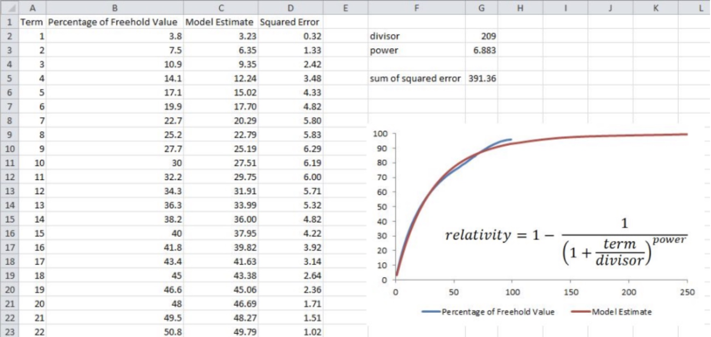

# General description
We conducted our feature engineering with the aim of producing as many useful features as possible to complement the raw data that has been provided. 

# Data processing
* Dropping duplicate transactions
* Coercing low count categories to `OTHER` (as described in the exploratory data analysis portion)
* Converting datetime columns to simpler, numerical columns
* Extracting the middle floor number from `storey_range` as this indicates the 'average' value between the range of floors indicated.
* Remaining lease was imputed using a 99-year lease assumption for HDB flats, which was then transformed into `relative_tenure`.
* Using a per-square metre price instead of the resale price itself, due to a high correlation between them.

# Feature engineering

## Target variable
We used resale_price and floor_area to compute the CPI-adjusted price-per square metre (`cpi_psm`) which should be used as an indicator of the underlying value of a property. It is the easiest way to ensure that we have an apple to apples comparison when comparing properties’ values within a market. 

## Predictors
| Feature | Type | Engineering | Reason |
|---------|------|-------------|--------|
| `floor` | NC | Since the data does not provide the exact floor, we take the middle value of the `storey_range` column. | I |
| `age`   | NC | We computed the building’s age using `sale_date - lease_commence_date` | I |
| `relative_tenure` | NC | `remaining_lease` was imputed using the fact that all HDB properties have a 99-year lease. This was then transformed into relative_tenure. This measure of relativity relates the term left for a property to the percentage of freehold value by curve fitting. The equation is set up as a discount formula and minimises the sum of squared errors. See curve and formula below. | I |
| `floor_area` | NC | Floor area of property in square metres. | I |
| `nearest_<point of interest>` | NC | `nearest_<point of interest>` features using a property’s coordinates and point of interest coordinates (obtained using OneMapAPI and Google Maps API - see below table). The distances are in kilometres. | Our hypothesis is that the nearby amenities and points of interest will be significant in a property’s value. |
| `sale_month` | ND | Converting datetime columns to an encoded numerical feature sale_month for our single models. sale_month assigns each month with a number and it’s ordered from 1 for the earliest month and increments up to the latest month. | Valuations are time varying dependent on the economy, the housing market and the government’s policies. |
| `cpi` | NC | Data provided by the Monetary Authority of Singapore (MAS) | Since our data spans a long time period, correcting resale prices to the present requires the use of CPI data. |
| `avg_sora` | NC | Data provided by MAS | We hypothesise that interest rates have an effect on the prices of homes. | 
| `is_imputed_sora` | CB | An indicator on whether the avg_sora for that observation was imputed with the mean. | Additional information for the model to infer whether it is an observed sora or imputed. |
| `flat_type` | CN | Type of HDB flat. Low counts were coerced to `OTHER`. Cutoff ($>= 50000$) chosen with elbow plot. | EDA | 
| `flat_model` | CN | Flat model. Low counts were coerced to `OTHER`. Cutoff ($>= 9000$) chosen with elbow plot. | EDA |
| `town` | CN | Town where the property is located in. Low counts were coerced to OTHER. Cutoff ($>= 12000$) chosen with elbow plot. | EDA | 
| `period` | CO | `period` for our rolling models. period is a quarterly label e.g. `1991Q1`, `1991Q2`, `1991Q3`, `1991Q4`,`1992Q1`, etc. | Same as `sale_month` but different representation for rolling models. |

## Shorthand used:

* NC = Numerical (continuous)
* I = Well-known and undamentally important features that determines a property's value.
* ND = Numerical (discrete)
* CB = Categorical (boolean)
* CN = Categorical (nominal)
* EDA = Based on EDA done (see section on EDA for more complete explanations)
* CO = Categorical (ordinal)

## Relativity measure for tenure

# Adding location data
In order to inject more features into the dataset, we decided to use the [OneMap API](https://www.onemap.gov.sg/docs/) to attain the various ATM, bus stop, hawker centre, library, parks, pharmacies, post office, primary school, store, and train station locations in terms of their latitudes and longitudes. Furthermore, we used the [Google Maps API](https://developers.google.com/maps/documentation) to also geocode the addresses of the HDB resale flats in our dataset. 

There were, however, some addresses (n = 149) that have failed to be retrieved via geocoding, and some of them (n = 46) also had issues with respect the geocoding that was retrieved, out of a total of 9,307 unique HDB flat addresses that were included in the dataset. Although the former was dropped, the latter was included as we decided that the detrimental effect of a 'wrong' geocode was insignificant, and since there might still be useful information to be extracted from other features.